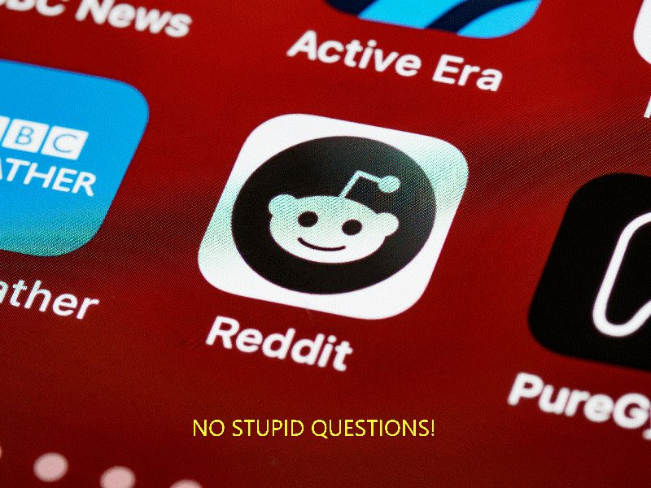
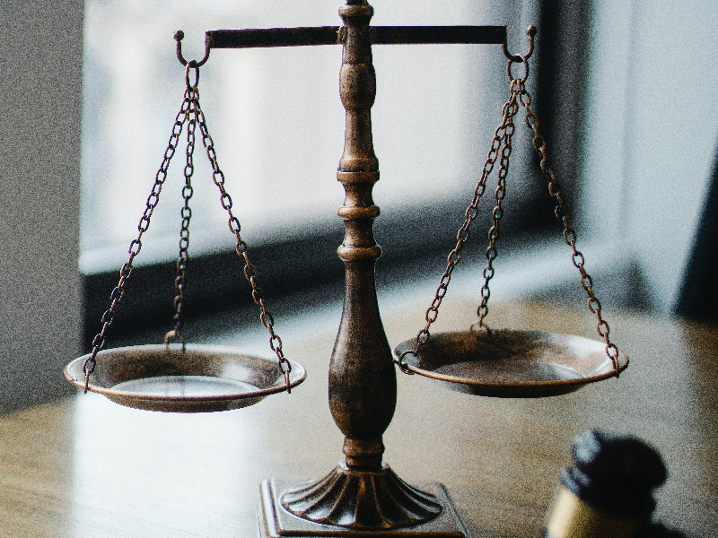
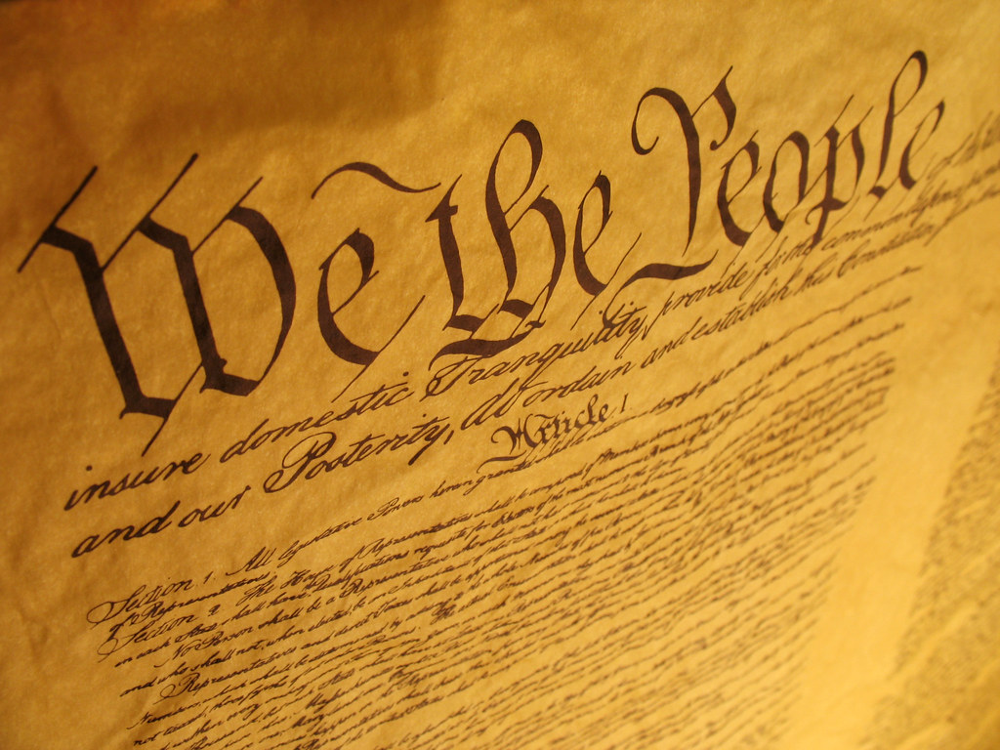
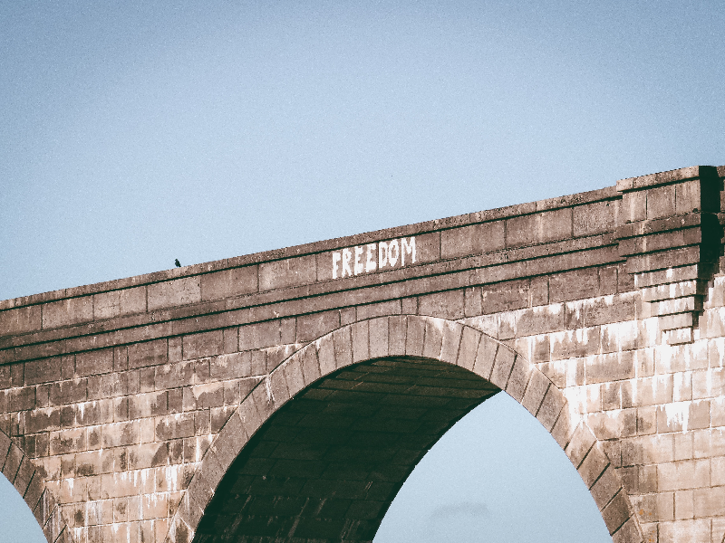

The world of Reddit: a vast digital landscape where users from every corner of the globe come together, sharing stories, ideas, and a meme or two. With its upvote system and passionate communities, Reddit has become the "front page of the internet."

However, like any bustling metropolis, Reddit has its regulations, its order, and its gatekeepers: the moderators. These individuals, often volunteers, hold the power to maintain the integrity and culture of their communities by removing posts and comments they deem inappropriate.

> "Freedom is never more than one generation away from extinction." - Ronald Reagan

## The Power of Moderation

Reddit's design empowers moderators to curate content within their subreddits. This decentralization ensures that each community maintains its unique flavor and standards. However, with such power comes the potential for overreach.

Consider the hypothetical case of a user posting a comment or story that toes the line of a subreddit's rules. The user believes they are contributing positively, but a moderator might see things differently. The post gets removed.

Now, this is not to say that all moderation is questionable. Far from it. Moderators play a crucial role in maintaining the integrity of their communities. Yet, there remains a gray area: when does moderation infringe upon the cherished ideal of freedom of speech?

## The Constitutional Perspective

The First Amendment to the United States Constitution states:

> "Congress shall make no law... abridging the freedom of speech..."

On its face, Reddit, as a private entity, is not bound by this amendment. However, the spirit of freedom of expression is deeply woven into the fabric of American society. Does, or should, this spirit extend to digital platforms like Reddit?

## The Balance

Reddit stands as a private platform, with the right to set and enforce its terms of service. Yet, the influence and reach of Reddit cannot be denied. For many, it's a primary source of information, debate, and community.

So, the question emerges: Should Reddit's vast influence bring with it a heightened responsibility to uphold freedom of speech? And where do we draw the line between necessary moderation and censorship?

## In Conclusion

The digital age presents new challenges for the age-old values of freedom and expression. Platforms like Reddit are at the forefront of this evolving conversation. It's essential to approach this topic with nuance, understanding that the answer isn't black and white.

Moderators, with their vital role, must wield their power responsibly, bearing in mind the broader implications of their actions. At the same time, users should remember the platform's private nature and the necessity of some level of moderation.

As we navigate this digital era, let's strive for a balance, cherishing our freedom while understanding the need for order. After all, in the vast world of the internet, caution and critical thinking are our best allies.

---

*Join the conversation, and share your thoughts on [Dev Principia's Discussion Forum](https://twitter.com/DevPrincipia).*
