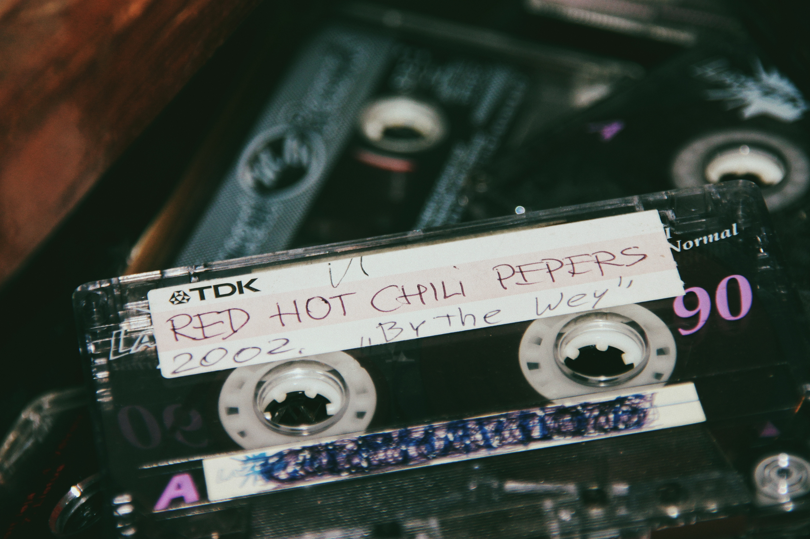

Pop culture, or popular culture, refers to the set of ideas, perspectives, attitudes, images, and other phenomena that are within the mainstream of a given culture. It is heavily influenced by mass media, and has a profound impact on our society, shaping and reflecting trends, values, and beliefs.

## What is Pop Culture?

Pop culture encompasses the most widespread aspects of cultural life, including music, movies, television, sports, news, fashion, technology, and more. It is characterized by its accessibility to the general public and its ability to change and evolve quickly. Pop culture both shapes and is shaped by the larger societal context, reflecting and responding to changes in social attitudes, trends, and events.

## Origins of Pop Culture

The term "pop culture" emerged in the mid-20th century, coinciding with the rise of mass media and the cultural shift that occurred with the post-war consumer boom. It was during this time that television, cinema, and radio became dominant forms of entertainment, reaching a wide and diverse audience and shaping public opinion and tastes.

> "Pop culture is not about depth. It's about marketing, supply and demand, consumerism." - Trevor Dunn

## Influence on Movies and TV

Movies and television are key elements of pop culture, with popular shows and films having a significant impact on societal trends, fashion, and attitudes. Iconic franchises like 'Star Wars', 'Friends', and 'Game of Thrones' have become cultural phenomena, influencing everything from language and humor to fashion and values.

## Pop Culture in Music

Music is a powerful driver of pop culture, with popular artists and songs shaping trends and reflecting societal values. From The Beatles and Madonna to Beyoncé and BTS, popular music artists have a profound impact on pop culture, influencing fashion, dance, and even social movements.

## Pop Culture in Fashion and Technology

Fashion and technology are also influenced by and influencers of pop culture. Trends in clothing, accessories, and technology can reflect popular films, music, and other cultural phenomena. Similarly, innovations in technology often create new trends and change the way we consume and interact with pop culture.

## Notable Pop Culture Phenomena

| Media | Title/Name | Year | Key Figures |
| :---- | :---- | ----: | :-------------- |
| Movie | Titanic | 1997 | James Cameron |
| Music | Thriller | 1982 | Michael Jackson |
| TV Show | The Simpsons | 1989 - Present | Matt Groening |
| Fashion | The Mini Skirt | 1960s | Mary Quant |
| Technology | iPhone | 2007 | Steve Jobs |
| Music | "Gangnam Style" | 2012 | PSY |

## Conclusion

Pop culture is a powerful force in our society, reflecting and shaping our collective ideas, attitudes, and experiences. It is a mirror of our times, providing a snapshot of the social, political, and cultural climate of any given era. While it can be ephemeral, its influence is profound, shaping our identities, our society, and our understanding of the world.

[Further Reading on Pop Culture](https://en.wikipedia.org/wiki/Popular_culture)

